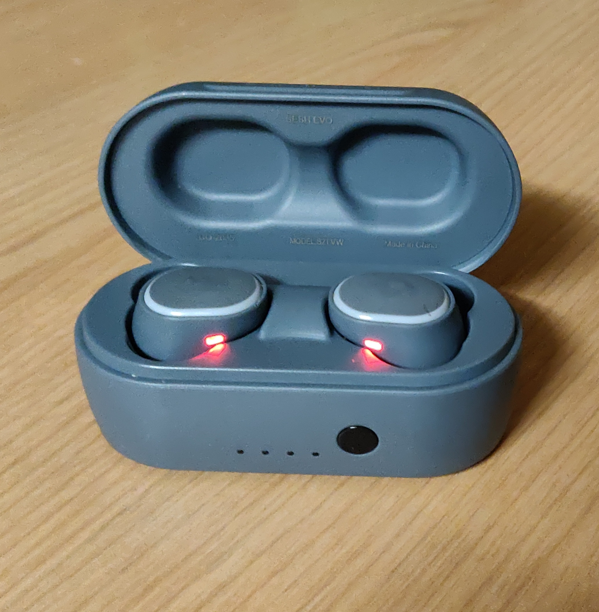
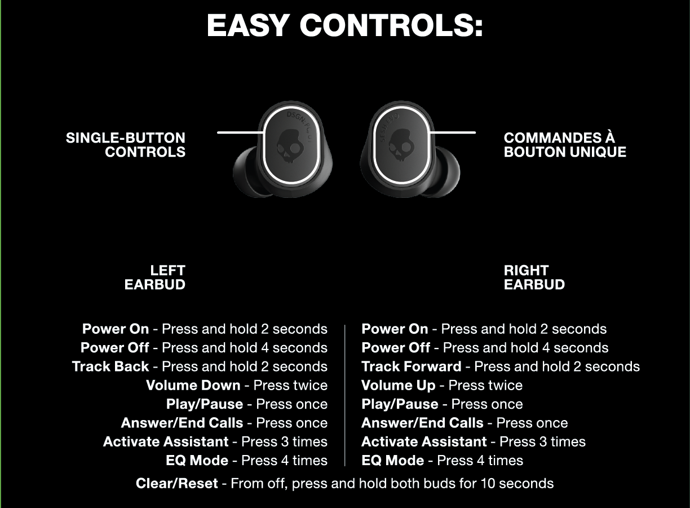

# Skulcandy Sesh Evo User Experience
## By Ethan Shelley 2/23/22

The Skullcandy Sesh Evo wireless earbuds don’t have the most user friendly controls to those who haven’t mastered them. The any time a user wants to pair them to a new 
device they have a laborious method for connection that can feel **ineffective** and **unsatisfactory**. This is due to the method you have to connect them through. First, you must pair
the individual earbuds to each other, to do this you must set them in their case and after the led turns red you take them out and they are meant to automatically pair to each 
other. This is where the first problem lies, when using Bluetooth devices users will turn on the Bluetooth pairing on their own device (ie. phone, computer, laptop, etc.) in 
order to connect with the new device. Through my experience using the Shesh Evos, leaving the Bluetooth on and searching on my phone when trying to get the initial paring done
interferes with the pairing of the earbuds to each other. And in other scenarios the earbuds simply did not connect to each other even when no potential interference was 
present. Due to this at times when trying to connect them to new devices the connection process feels **inefficient** and/or **ineffective**. However I find their usage after the 
initial connection very **satisfying** and **inefficient**, this is due to how easy it is to use them strictly for playing audio. After the initial connections are done and the earbuds
are paired to the device you want, as long as Bluetooth is enable on that device all I need to do is take the earbuds out of their case and as long as they are charged they will
automatically turn on and connect to my device. This is something I find very **satisfying** about using them.

The other main feature of these earbuds past playing audio is the controls you have, specifically when playing music. There are a multitude of actions you can do with the earbuds
and it will differ depending on the earbud you use. This and the fact that to perform these actions is all through only one button makes it not very **learnable** or **memorable**. The 
reason for this lower **learnability** and **memorability** is because the designer is trying to make the earbuds more **useful** in its capabilities. Overall, from my experience this has 
only made the earbuds used strictly for playing music. It doesn’t feel worth my time to try and learn the controls when I can still do all the provided actions with my phone (the 
primary device I use the earbuds with).
	
