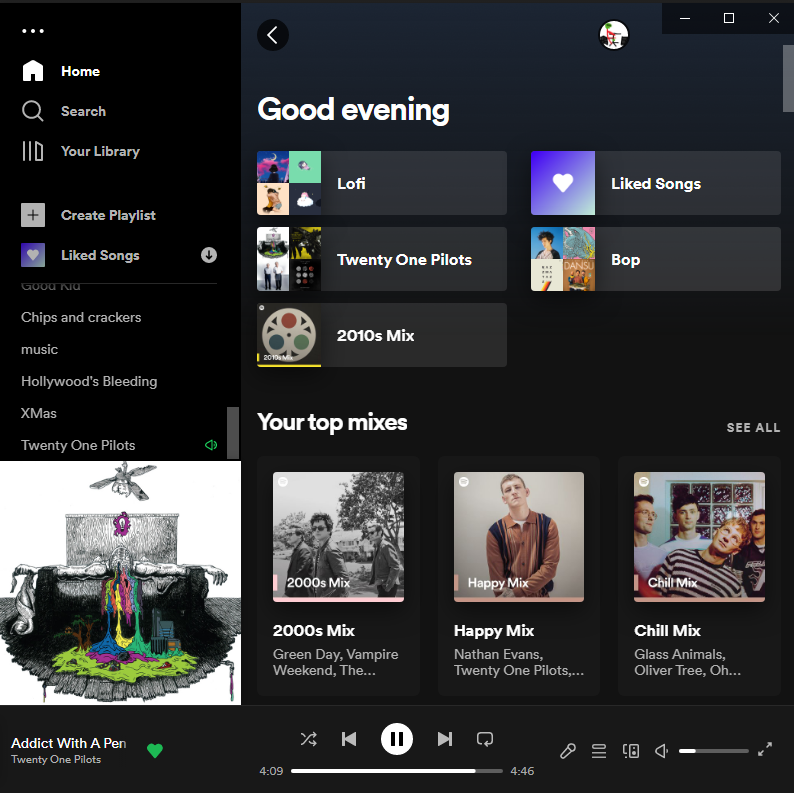
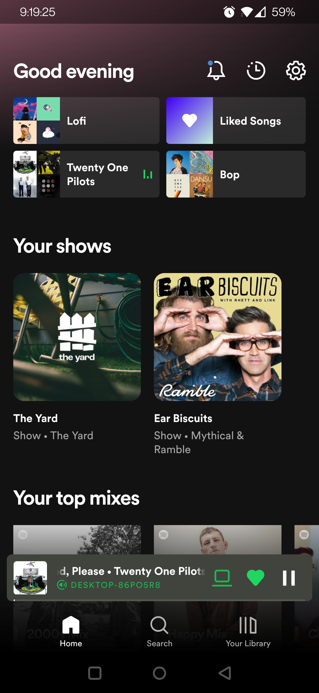

# Spotify User Experience
## By Ethan Shelley 5/10/22

[Back to home page](ux-portfolio-otto6x)

 
Spotify is the most popular music streaming service in the United States. And there user interfaces(PC on left, Mobile on right), 
are fairly learnable and effective when it comes to playing a song the user desires. Where both interfaces do not excel, however, 
is when a user tries to play music not readily available on the home screen or to play a specific song. Doing these task are not efficient, 
they take multiple clicks(or taps), and depending on how you approach playing the music it can take more.

Both have a very easy to use search feature, so on that regard playing music is efficient, the decrease in efficiency comes from music playing 
after that first song is played. The app is designed to automatically start playing from a radio based on the song originally played. This is accomplished 
on the song ending, however, there are times when the app doesn’t begin playing radio and just sits idle. When this error occurs the user will have to 
manually navigate the menu to play the radio or play a new song of their choosing. An alternate method to playing a song that comes with avoiding this error 
is to play a song from a playlist. However, there are still some downsides to this method that can make it inefficient. If there is a specific song the user 
wants to play that is in the playlist, they will have to find that song and then play it. After the song is finished it will continue playing from that playlist
depending on the user's order settings(shuffled or not). So this seems like a good method to play songs. The problem lies in playing that specific song. 
The user can scroll through the playlist and find the song, but if the playlist is large it will slow down the user from playing their song. Using the built 
in search feature on the playlist will allow the user to play any desired song given it is in the playlist. However, when using the search to play a song the 
list of songs that will play will be reduced based on the search. So, when the searched song is finished playing it will only pick songs that were filtered into 
the search and if there are no more it will attempt to play radio which had the potential of running into an error again.

The workaround to this is not having a particular song to play or using the mobile app instead. Using the mobile app completely avoids the problem of 
restringing the playlist. This major difference in functionality is not the only kind between the PC and mobile apps.

Other than slight differences in UI presentations and text most features are identical. A difference that reduces the effectiveness of playing from 
a playlist on mobile is how the search and filtering are presented to the user. 

When opening a playlist on mobile you are presented with a home screen for the playlist (left). Seeing the songs fade to the bottom of the screen clearly 
conveys to the user that they can scroll down. And in the middle, there is a multitude of buttons including a “more” button (the three vertical dots). If the 
user were to try to search for a song they would look at the middle section and see no search feature, then they would open the “more” screen. However, they 
will not be presented with a search function nor will they see a filter option either. Instead, the correct method to navigate to the search option(right) is 
to scroll up. This ability is not made apparent to the user in any way. I personally only heard of this last year and I have been using Spotify on my phone 
for over 6 years ago. Another major functionality difference between the two apps is the “Enhance” button on the home page of a playlist. This is only available 
for Mobile even though both apps will play from the same playlist. This feature allows the user to automatically add songs to a playlist based on what is in 
there already. This feature is already available to both apps via scrolling to the bottom of the playlist (or in the mobile apps case the add songs button also works).
However, this only presents a limited amount of songs to the user at a time and the user has to manually add them. So using the “Enhance” feature is more efficient 
for users but also its song limit is tied to the number of songs in the playlist. It will add a song for every 2-4 songs in the playlist and the added song is 
based on those 2-4 songs. So using this on a small playlist will add fewer than what is recommended but on a larger playlist, it will add more.

These differences do not take too much away from the apps individually in terms of efficiency or effectiveness. However, the issues come in learnability if a 
user uses both apps in tandem. This heavily affects the ease of a user switching between the two apps in order to play music. And in some scenarios, it actually
will be harder for the user to play music.

